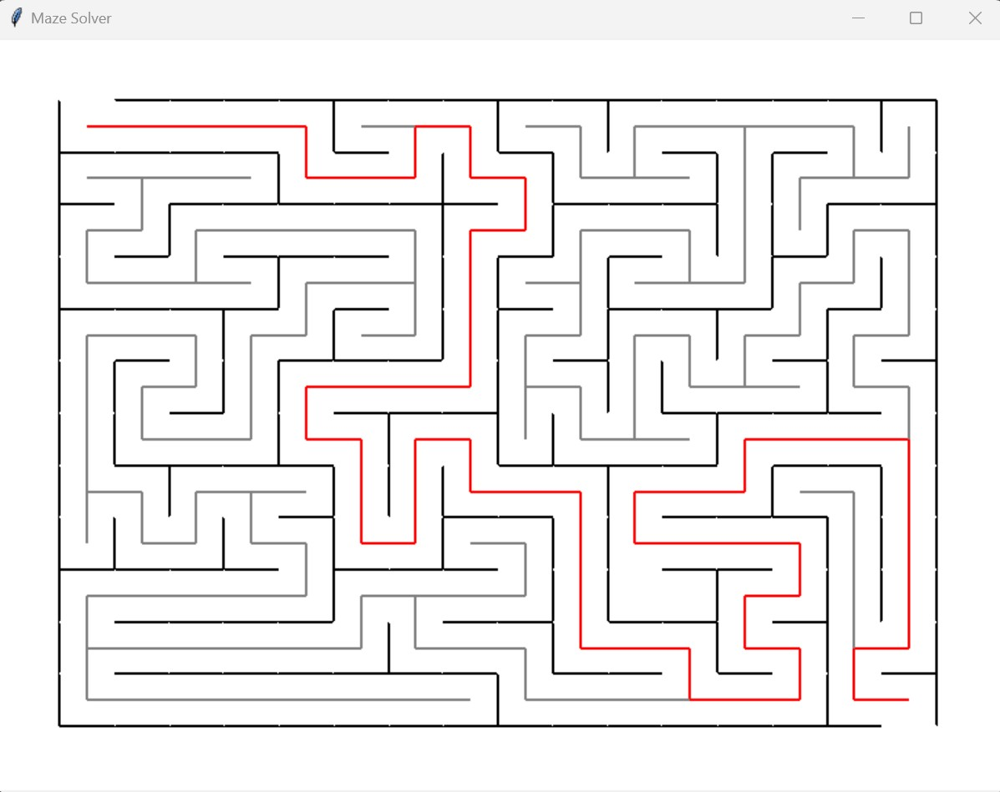

# Maze Solver
_Implementing knowledge from a course in boot.dev to build a maze solver_
### **_Author:_**
Hunter Bernier
### **_Code Explanation:_**
* A grid of cells is drawn onto a tkinter window
    * The size of the grid is determined by the user when calling the Maze class within main()
* The first traversal through the grid is to create the maze
    * This process is done recursively and randomly that way the maze is different each time
        * The seed variable will need to be removed to allow the randomness to occur
        * It was added for testing purposes
* The second traversal of the grid is to solve the maze
    * This process is done recursively
    * The red line is the correct path and the grey lines are the paths that did not lead to the exit
* Once the code is done running, it will tell the user if the maze was solved or not in the terminal
    * This can also be determined by looking to see if the red line touches both the top left cell and bottom right cell
* Below is a snapshot of a maze that has been fully solved:
